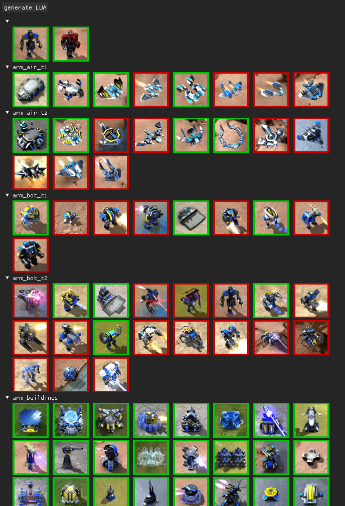

# toggle_tweak
"Beyond all reason" game unit tweak script



You can toggle which units will be disabled.

start it by:
```bash
$python toggle_tweak.py
```

select what you want to disable. red box around the image = disabled.

then press "generate LUA" at the top left.
it will generate two files in the folder tweak_output.

one is called lua_json.txt
it will look like this:
```json
{
  armfig = { maxThisUnit = 0 },
  armkam = { maxThisUnit = 0 },
  armpeep = { maxThisUnit = 0 },
}
```

the other is the paste command you have to paste into the lobby chat.
it will look like this:
```lua
!bset tweakunits <base64 gibberish>
```

based on the guide here:
https://gist.github.com/efrec/153081a7d43db3ad7a3c4fc5c9a689f8


the sorting of the units is based on the file folder structure in "unitpng".